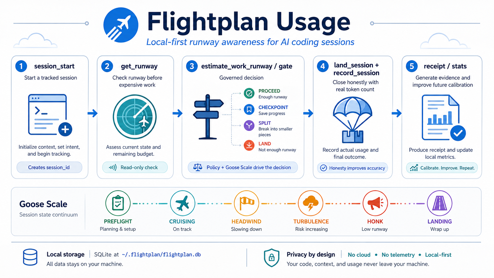

# 🪿 Flightplan

> **Token runway awareness for AI coding sessions.**  
> A goose knows how far it can fly before it needs to land.

<p align="center">
  
</p>

---

## What is Flightplan?

Flightplan is a local-first MCP (Model Context Protocol) server that gives AI coding agents **token runway awareness**. Before starting a large refactor, generating a complex component, or any high-cost operation, the agent calls `get_runway()` and knows whether it has enough runway to proceed — or whether it should wrap up and land first.

Flightplan also provides a **runtime observation layer** — structured sensor output that captures actual token consumption, estimate variance, and recommended actions. This observation interface is designed for integration with governance systems (like the Librarian) that consume evidence and make authority decisions.

One SQLite file in `~/.flightplan/`. Optional token source adapters (e.g. OpenWork) can connect to external telemetry when available.

---

## The Problem

AI coding agents (Claude Code, Codex, Gemini CLI) have finite context windows. When a session runs out of tokens mid-task:

- Work is lost
- The agent cuts off mid-thought
- The user has to restart and re-explain context
- Expensive operations get abandoned halfway

Providers don't publish hard token limits. They use opaque session windows that change with demand. Community estimates go stale silently.

**Flightplan's answer:** stop guessing. Track real burn. The user sets a baseline at init. The agent self-reports at session end. Dead Reckoning (Phase 2) calibrates automatically from real observed data.

---

## The Goose Scale

Eight flight states covering the full session lifecycle:

| Level | Meaning | % Consumed |
|-------|---------|------------|
| `PREFLIGHT` | No session active — waiting for `session_start()` | — |
| `CRUISING` | Nominal burn. Runway estimate is reliable. | 0–50% |
| `HEADWIND` | Burning faster than baseline. Still on course. | 50–75% |
| `TURBULENCE` | Tight runway. Wrap up soon. | 75–85% |
| `HONK` | Runway exhausted. Call `record_session()` now. | 85%+ |
| `LANDING` | Session ended gracefully. Data archived. | — |
| `REFUELLED` | New session started. Runway restored. | — |
| `WAYWARD` | Dead Reckoning drifted significantly. | — |

HONK fires at 85% (not 90%) deliberately. The configured baseline is an
estimate, not a hard wall. The 15% margin gives the agent enough room to
finish a thought, write `record_session()`, and land cleanly instead of
cutting off mid-sentence.

---

## Quick Start

### Install

```bash
git clone https://github.com/andrewdhannah/flightplan-mcp.git
cd flightplan-mcp
nvm use 20
npm install
npm run build
npm run smoke
npm link                    # makes `flightplan` available globally
```

See [docs/INSTALL.md](docs/INSTALL.md) for detailed install instructions,
including MCP client configuration for Claude Desktop, Codex, and OpenWork.

### Initialize

```bash
flightplan-mcp init
```

Three questions. 30 seconds. Done.

### Check your runway

```bash
flightplan status
```

```
🪿 Flightplan  ·  CRUISING  ·  Claude Code

  [████████████░░░░░░░░░░░░]  52% remaining

  Session
    Tokens observed   20,800 / 40,000 baseline
    Runway remaining  19,200 tokens
    Duration          34 min

  Status
    Nominal burn rate. Runway estimate is reliable.

  Dead Reckoning
     3 sessions archived  ·  2 more until baseline auto-calibrates
```

### Estimate runway for a task

```bash
flightplan estimate --model deepseek-v4-flash --provider OpenWork --json
```

### Check gate decision before expensive work

```bash
flightplan gate --model deepseek-v4-flash --provider OpenWork --work-type sprint --json
```

---



---

## MCP Tools

Flightplan registers six MCP tools. Detailed documentation with input schemas
and examples: [docs/MCP-TOOLS.md](docs/MCP-TOOLS.md)

| Tool | Purpose | Mutates DB |
|---|---|---|
| `get_runway()` | Check current token runway state | No |
| `session_start(...)` | Open a new tracking session | Yes |
| `record_session(...)` | Archive session data and close | Yes |
| `estimate_work_runway(...)` | Estimate runway + governed decision | No |
| `land_session(...)` | Assess landing requirements | No |
| `emit_observation(...)` | Structured runtime resource observation | No |

### `get_runway()`

Check current token runway state. Call at session start and before any
high-cost operation. No parameters required.

```json
{
  "level": "CRUISING",
  "window_remaining_pct": 52,
  "window_remaining_tokens": 19200,
  "token_range": null,
  "burn_rate_per_hour": null,
  "time_remaining_minutes": null,
  "data_source": "agent_report",
  "formation_trust": "observer",
  "recommended_action": "Runway is healthy. Proceed with planned work."
}
```

### `session_start(provider?, model?, project_id?, ...)`

Open a new tracking session. All parameters optional.

```json
{
  "session_id": "a1b2c3d4-...",
  "started_at": "2026-05-04T19:30:00.000Z",
  "level": "REFUELLED",
  "message": "Session started. Runway restored."
}
```

### `record_session(tokens_total, notes?, outcome?, ...)`

Archive session data and close the session. `tokens_total` is required.

```json
{
  "session_id": "a1b2c3d4-...",
  "tokens_total": 28500,
  "duration_minutes": 47.3,
  "final_level": "HEADWIND",
  "sessions_archived": 4,
  "outcome": "completed",
  "message": "Session archived. 28,500 tokens over 47.3 minutes."
}
```

### `estimate_work_runway(model?, provider?, project_id?, work_type?, ...)`

Estimate token runway for a proposed task. Combines Dead Reckoning historical
data with gate policy. Returns a governed decision.

```json
{
  "decision": "proceed",
  "confidence": "medium",
  "estimated_tokens": { "p50": 18000, "p80": 45000, "p95": 85000 },
  "goose_level": "PREFLIGHT",
  "recommended_action": "Normal work allowed. Monitor runway and re-evaluate before major operations.",
  "policy_reasons": ["No active session — using conservative estimate"]
}
```

### `land_session(tokens_total?, outcome?)`

Assess whether the session needs to land. Returns landing recommendation,
handoff template, and whether `record_session` can be called.

```json
{
  "level": "PREFLIGHT",
  "landing_required": false,
  "can_record": false,
  "recommended_action": "No active session. Call session_start() to begin tracking."
}
```

### `emit_observation(session_id?, work_packet_id?, work_order_id?, model?, provider?, project?)`

Emit a structured RuntimeResourceObservation — a sensor snapshot of current
token consumption, Dead Reckoning estimate, and variance classification.
This is Flightplan's observation interface for governance systems (like the
Librarian) that consume evidence and make authority decisions.

Flightplan produces the observation; it does not persist it (the consumer
decides what to do with it) and does not make policy decisions.

```json
{
  "observation_id": "OBS-m1abc2-def123",
  "observation_type": "runtime_resource",
  "session_id": "a1b2c3d4-...",
  "timestamp": "2026-08-25T12:00:00.000Z",
  "model_identity": {
    "provider": "OpenWork",
    "model": "claude-sonnet-4-6"
  },
  "consumed": {
    "tokens_observed": 12000,
    "goose_level": "CRUISING",
    "elapsed_minutes": 15.2
  },
  "estimate": {
    "estimator_id": "token-cost-estimator-v1",
    "confidence": "medium",
    "percentiles": { "p50": 18000, "p80": 45000, "p95": 85000 },
    "sample_count": 10,
    "match_scope": "provider_model"
  },
  "variance": {
    "state": "NOMINAL",
    "pct_of_p50": 66.7,
    "pct_of_p80": 26.7,
    "remaining_tokens": 28000
  },
  "recommended_action": "Consumption is within expected range. Proceed normally."
}
```

---

## Using Flightplan with Other Tools

Flightplan works with any LLM client, regardless of whether it supports MCP.
There are three integration patterns, in order of preference:

### Pattern 1 — Native MCP

If your client supports MCP, Flightplan plugs in directly. All six tools —
`get_runway`, `session_start`, `record_session`, `estimate_work_runway`,
`land_session`, `emit_observation` — become callable from inside your session.

**Claude Desktop** (`~/Library/Application Support/Claude/claude_desktop_config.json`):

```json
{
  "mcpServers": {
    "flightplan": {
      "command": "npx",
      "args": ["-y", "flightplan-mcp"]
    }
  }
}
```

**OpenAI Codex** (`~/.codex/config.toml`):

```toml
[mcp_servers.flightplan]
command = "npx"
args = ["-y", "flightplan-mcp"]
```

**GitHub Copilot** (VS Code — `.vscode/mcp.json`):

```json
{
  "servers": {
    "flightplan": {
      "command": "npx",
      "args": ["-y", "flightplan-mcp"]
    }
  }
}
```

> **Copilot Business / Enterprise users:** MCP requires the
> "MCP servers in Copilot" policy to be enabled by your org admin.
> Copilot Free, Pro, and Pro+ are not affected by this restriction.

This is the richest integration: the agent can check runway mid-session and
adjust behaviour without any wrapper code.

### Pattern 2 — CLI as a function tool

If your client supports custom tools or function calling but not MCP, register
`flightplan status --json` as a tool. The agent calls it like any other
function and receives structured runway data.

```ts
// Example shape — adapt to your framework
{
  name: "get_runway",
  description: "Check current token runway state.",
  handler: async () => {
    const { stdout } = await execFile("flightplan", ["status", "--json"]);
    return JSON.parse(stdout);
  }
}
```

> Use `execFile` (or an async `exec` wrapper) rather than `execSync`.
> A blocking call inside an async tool handler will stall the agent loop.

### Pattern 3 — Markdown snapshot

For clients with no tool-calling at all (plain chat windows, mobile clients),
use `flightplan export` to produce a `RUNWAY_STATE.md` snapshot. Paste or
upload it and the model gets the same context — just without live updates.

```bash
flightplan export           # writes ./RUNWAY_STATE.md
flightplan export --out ~/Desktop/RUNWAY_STATE.md
```

### Carrier compatibility

| Mode | Command | Best for |
|:---|:---|:---|
| MCP Live | `get_runway()` called by agent | Clients with native MCP |
| JSON Pipe | `flightplan status --json` | Frameworks with custom tools |
| MD Snapshot | `flightplan export` | Plain chat UIs, handoffs |

> MCP support changes quickly. Check your client's current docs before
> committing to an integration pattern.

### Recommended call points

Whichever pattern you use, the same three call points apply:

- **`session_start()`** — when the agent begins meaningful work
- **`get_runway()`** — before any expensive operation
- **`record_session()`** — at session end, to archive tokens and feed Dead Reckoning

---

## Agent Lifecycle Usage

For long-running agent work, FlightPlan should be checked at startup,
before expensive actions, periodically during long sessions, and during
handoff/closeout.

FlightPlan defines three lifecycle hooks:

1. **Startup / Preflight** — assess runway before beginning work
2. **Periodic Check** — re-assess before expensive operations
3. **Handoff / Closeout** — land the session and record evidence

Details and copy-paste templates:

- [Agent Lifecycle Integration Guide](docs/AGENT-LIFECYCLE-INTEGRATION.md)
- [Agent Packet Template](docs/AGENT-PACKET-FLIGHTPLAN-TEMPLATE.md)

```text
FlightPlan Startup: status + stats + estimate + gate + (optional) session_start
FlightPlan Check:   gate --model <m> --provider <p> before expensive operations
FlightPlan Landing: land + record_session + receipt + stats + calibration report
```

---

## Architecture

```
flightplan-mcp/
├── src/
│   ├── index.ts              ← MCP server entry point (6 tools)
│   ├── cli.ts                ← flightplan-mcp init wizard
│   ├── status.ts             ← flightplan status CLI + command routing
│   ├── commands.ts           ← CLI command handlers (stats, gate, etc.)
│   ├── types.ts              ← shared TypeScript interfaces
│   ├── db/
│   │   ├── paths.ts          ← cross-platform DB path (~/.flightplan/)
│   │   ├── schema.ts         ← SQL DDL (config, active_session, usage_snapshots)
│   │   └── connection.ts     ← DB singleton + WAL mode
│   ├── tools/
│   │   ├── get_runway.ts     ← MCP tool: check runway state
│   │   ├── session_start.ts  ← MCP tool: open tracking session
│   │   └── record_session.ts ← MCP tool: archive session data
│   ├── analytics/
│   │   ├── stats.ts          ← aggregate usage statistics
│   │   ├── calibration.ts    ← calibration eligibility rules
│   │   ├── anomalies.ts      ← anomaly detection
│   │   ├── dead_reckoning.ts ← historical token estimation (p50/p80/p95)
│   │   ├── gates.ts          ← governed proceed/split/land decisions
│   │   ├── receipts.ts       ← session receipt generation
│   │   ├── landing.ts        ← landing assessment with handoff
│   │   ├── percentiles.ts    ← p50/p80/p95 calculation
│   │   ├── variance.ts       ← estimate-vs-actual variance classification
│   │   └── types.ts          ← shared analytics types
│   ├── state/
│   │   ├── goose_scale.ts    ← 8 flight states + level calculation
│   │   └── state_generator.ts ← RUNWAY_STATE.md Markdown snapshot generator
│   ├── observations/
│   │   ├── tool.ts           ← MCP tool: emit_observation
│   │   ├── emission.ts       ← RuntimeResourceObservation builder
│   │   ├── lifecycle.ts      ← runtime lifecycle events
│   │   └── action.ts         ← runtime action events
│   └── tokensource/
│       ├── types.ts          ← TokenSource interface + registry
│       ├── integration.ts    ← TokenSource initialization and routing
│       └── openwork_adapter.ts ← OpenWork telemetry adapter (optional)
└── scripts/
    └── smoke-test.js         ← dependency verification
```

**Key decisions:**

- **Two binaries:** `flightplan-mcp` (MCP server / init) and `flightplan` (status CLI). Different names, different jobs.
- **Single DB file:** `~/.flightplan/flightplan.db` holds everything. No separate config file.
- **Agent self-report as primary, telemetry as optional:** The normal flow is agent self-report at session end. Optional TokenSource adapters (e.g. OpenWork) can provide real telemetry when available, but Flightplan works without them.
- **Provider-agnostic:** No hardcoded plan limits. User sets their own session baseline at init. Providers don't publish hard limits anyway — community estimates go stale silently.
- **ESM throughout:** `"type": "module"` in package.json. All imports use `.js` extensions per TypeScript ESM requirements.
- **Local-first core, optional network:** The core Flightplan system is local-only. TokenSource adapters may make network requests to external telemetry sources when configured and enabled.

---

## Database Schema

Three tables. All in `~/.flightplan/flightplan.db`.

**`config`** — key/value store for user settings from init.

| Key | Example Value |
|-----|--------------|
| `provider_name` | `Claude Code` |
| `provider_key` | `claude_code` |
| `session_baseline` | `40000` |
| `baseline_source` | `default` \| `manual` \| `calibrated` \| `api` |
| `warn_threshold` | `25` |
| `initialized_at` | ISO timestamp |

**`active_session`** — single-row table tracking the current session.

| Column | Type | FP-1 | Description |
|--------|------|------|-------------|
| `id` | `TEXT PK` | | Always `'current'` |
| `session_id` | `TEXT` | | UUID |
| `started_at` | `TEXT` | | ISO 8601 |
| `goose_level` | `TEXT` | | Current flight state |
| `tokens_observed` | `INTEGER` | | Running token count |
| `provider` | `TEXT` | | AI tool name |
| `model` | `TEXT` | | Model identifier |
| `project_id` | `TEXT` | | Project grouping tag |
| `plan_id` | `TEXT` | ✅ | Librarian Sprint/Plan ID |
| `work_order_id` | `TEXT` | ✅ | Librarian Work Order ID |
| `work_session_id` | `TEXT` | ✅ | Librarian Work Session ID |
| `agent` | `TEXT` | ✅ | Agent name |

**`usage_snapshots`** — historical archive of completed sessions. The ground truth for Phase 2 Dead Reckoning calibration.

All `active_session` columns above, plus: `ended_at`, `duration_minutes`, `tokens_total`, `goose_level_final`, `baseline_at_time`, `baseline_source_at_time`, `notes` (max 2,000 chars), and **FP-1 columns**: `plan_id`, `work_order_id`, `work_session_id`, `agent`, `outcome`.

---

## What Flightplan Stores

Everything lives in one SQLite file: `~/.flightplan/flightplan.db`.

**What is stored:**
- Provider name and key (e.g. `Claude Code` / `claude_code`) — set by you at init
- Session baseline and warning threshold — set by you at init
- Per-session data you explicitly record: token count, duration, model, project tag, optional notes
- **FP-1:** Optional Librarian work tags for session correlation: `plan_id`, `work_order_id`, `work_session_id`, `agent`
- **FP-1:** Optional session `outcome` for tracking completion status (`completed`, `checkpointed`, `stale`, `blocked`, `aborted`, `honk`)
- Timestamps for session start and end

**What is never stored:**
- Conversation content — not a single word of what you or the agent said
- API keys, credentials, or any authentication data (except when TokenSource adapters are configured — see Privacy section)
- Anything from your editor, terminal, or filesystem

**Notes field:** The optional `notes` parameter in `record_session()` is
agent-controlled freeform text (max 2,000 characters). It is capped and
sanitized before storage. If you render notes in a web UI, treat the value
as untrusted — never use `dangerouslySetInnerHTML` or parse as markdown
without sanitisation.

**Retention:** Data stays until you delete it. `~/.flightplan/flightplan.db`
is a standard SQLite file — open it with any SQLite browser, back it up,
or delete it at any time.

---

## CLI Commands

Full CLI reference: [docs/CLI.md](docs/CLI.md)

| Command | Description |
|---|---|
| `flightplan status` | Show current runway state |
| `flightplan stats` | Show aggregate usage statistics |
| `flightplan calibration report` | Calibration eligibility report |
| `flightplan calibration candidates` | List calibration-eligible sessions |
| `flightplan anomalies` | Detect anomalous sessions |
| `flightplan estimate` | Estimate token runway for a task |
| `flightplan gate` | Check governed runway decision |
| `flightplan receipt` | Export session receipt |
| `flightplan land` | Assess landing status |
| `flightplan export` | Write RUNWAY_STATE.md for any LLM |

All commands support `--json` for machine-readable output and `--help`
for command-specific help. Exit codes: 0 (success), 1 (error).

---

## Goose Scale Policy

Eight flight states governing agent behaviour:

| Level | Allowance | Action |
|---|---|---|
| `PREFLIGHT` | No active session | Call `session_start()` |
| `CRUISING` | Normal work allowed | Proceed |
| `HEADWIND` | Continue, no scope expansion | Finish current task |
| `TURBULENCE` | Checkpoint before expensive work | Wrap up soon |
| `HONK` | Land immediately | Call `record_session()` now |
| `LANDING` | Handoff/receipt only | Session ended |
| `REFUELLED` | New session started | Runway restored |
| `WAYWARD` | Calibration low, use conservative fallback | Dead Reckoning drifted |

The gate policy combines Goose Level with Dead Reckoning estimates to produce
guarded decisions: `proceed`, `proceed_with_checkpoint`, `split`,
`land_first`, or `refuse`.

---

## Testing

```bash
# Smoke test — verify dependencies and DB schema
npm run smoke

# MCP tool registration and schema validation
npm run smoke:mcp

# Build
npm run build

# Run all tests (276 tests, all using in-memory DBs)
npm test
```

All tests use **in-memory SQLite databases** — they never touch the live DB
at `~/.flightplan/flightplan.db`. The `FLIGHTPLAN_DB_PATH` environment
variable is available for redirecting the DB path in custom test scenarios.

---

## Privacy

Flightplan is local-first by design. Detailed privacy boundary:
[docs/FLIGHTPLAN-PRIVACY-BOUNDARY.md](docs/FLIGHTPLAN-PRIVACY-BOUNDARY.md)

- **No telemetry.** No cloud sync, no analytics, no crash reporting.
- **No conversation content.** Prompts, code, and agent responses are never stored.
- **Local DB only.** `~/.flightplan/flightplan.db` stays on your machine.
- **Notes excluded from receipts.** The optional `notes` field is agent-controlled
  freeform text stored in the DB but excluded from receipts by default.
- **No secrets stored.** Project IDs and work tags are metadata, not content.
- **Optional network.** TokenSource adapters (e.g. OpenWork) may make network
  requests to external telemetry sources when configured. They are not enabled
  by default and are not required for Flightplan to function.

---

### Phase 1 — Static Baseline ✅ *Complete*
User-set baseline. Agent self-reports. Goose Scale levels. Status CLI. MCP tools.

**FP-1 (v2 schema):** Librarian work-order tagging. `plan_id`, `work_order_id`, `work_session_id`, `agent`, and `outcome` fields on sessions. Auto-migration from v1 → v2.

### Phase 2a — Dead Reckoning Analytics ✅ *Complete (shipped in v0.2.0)*
Historical token estimation (p50/p80/p95 from `usage_snapshots`). Auto-calibrating baseline after 5+ eligible sessions. Confidence scoring. Calibration eligibility filtering. Anomaly detection. Gate policy (proceed / proceed_with_checkpoint / split / land_first / refuse). Session receipt generation. Landing assessment with handoff templates.

### Runtime Observation Layer ✅ *Implemented*
Structured `RuntimeResourceObservation` builder with variance classification (NOMINAL / ELEVATED / AT_RISK / EXCEEDED). The `emit_observation` MCP tool provides a clean sensor interface for governance systems. Runtime lifecycle events and action events are modeled. Flightplan produces observations; consumers (e.g. Librarian) decide what to do with them.

### TokenSource Abstraction ✅ *Implemented (not yet wired to live runway)*
Formal `TokenSource` interface with registry, scope filtering, and health checks. OpenWork adapter implemented. Architecture for real telemetry exists, but the normal MCP startup path does not yet initialize TokenSource or feed live usage into runway calculations.

### Phase 2b — Velocity Fields *(next)*
`burn_rate_per_hour` and `time_remaining_minutes` from active-work vs wall-clock duration. Project-specific velocity profiles via `project_id`. Provider/token-count fallback mode for agents without live token totals. Confidence intervals on estimates.

### Phase 3 — Formation Trust *(future)*
Community velocity profiles via Flock File. Opt-in anonymous session sharing. Formation Trust active state. HONK notes generated automatically.

---

## Development

```bash
# Clone and install
git clone https://github.com/andrewdhannah/flightplan-mcp.git
cd flightplan-mcp
nvm use          # requires Node 20 LTS — see .nvmrc
npm install

# Verify dependencies
npm run smoke

# Verify MCP tools register correctly
npm run smoke:mcp

# Build
npm run build

# Run all tests (in-memory DBs only)
npm test

# Initialize your own DB
npm run init

# Check status
node dist/status.js
```

**Node version:** Flightplan requires Node 18–22. Node 23+ cannot compile
the native SQLite dependencies. Use `nvm` to manage versions — a `.nvmrc`
is included.

**Test safety:** All tests use in-memory SQLite databases. They never touch
the live DB at `~/.flightplan/flightplan.db`. You can set the
`FLIGHTPLAN_DB_PATH` environment variable to redirect the DB for testing
or development purposes.

---

## Why Canadian?

PIPEDA and Quebec Law 25 compliance is a reasonable baseline for privacy-respecting local tools. No personal data leaves the machine. No provider data is hardcoded. The community localizes for other jurisdictions.

Also, geese are Canadian. This was non-negotiable.

---

## Contributing

Phase 1 is the calibration run. If you use Flightplan and want to contribute:

- **Flock File data:** Share anonymized session velocity profiles to improve community baselines. *(Phase 3)*
- **Provider profiles:** If you've characterized token behaviour for a provider not listed, open an issue.
- **Bug reports:** Open an issue. Include your Node version, OS, and the output of `flightplan status --json`.

---

## License

MIT — see LICENSE.

---

## Acknowledgements

Built by Andrew with Ash (Claude Sonnet 4.6) in two sessions, May 2026.  
*"The smaller version is the one that gets built."*

---

*🪿 The goose knows how far it can fly.*
